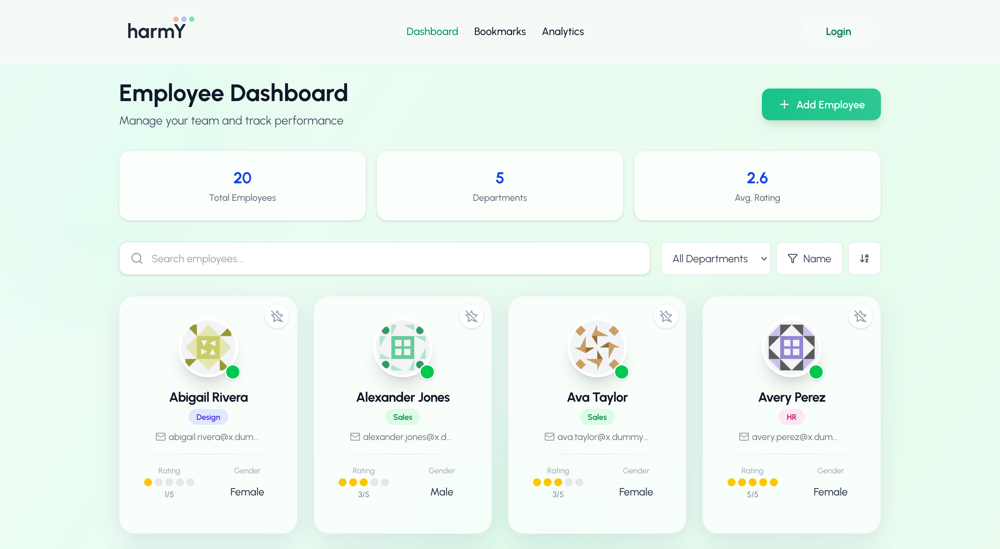

# harmY &nbsp; 

<p align="center">
  <b>Modern HR Platform &bull; People-first &bull; Progress-driven</b><br>
  <em>Built with Next.js, React, and a passion for great product design.</em>
</p>

<p align="center">
  
  
  
  
  
</p>

---

## 🚀 What is harmY?

A clean, modern HR platform for teams that value people and progress. Fast, beautiful, and focused on what matters. <br>
<em>Inspired by the best, built to be better.</em>

---

## 🖼️ Screenshots

|              Landing Page               |                Dashboard                |
| :-------------------------------------: | :-------------------------------------: |
|  |  |

|                Analytics                |            Employee Profile             |
| :-------------------------------------: | :-------------------------------------: |
|  |  |

---

## 🎥 Demo Video

[](https://github.com/vipulsc/projekt-harmy.git)

_Click the image to watch the demo video._

▶️ [Watch local demo video](public/demoVideo.mp4)

---

## ✨ Features

- **Dashboard:** Instant HR stats & quick actions
- **Analytics:** Visualize team data
- **Bookmarks:** Save what matters
- **Employee Profiles:** All details, one place
- **Authentication:** Secure, seamless sign-in
- **Responsive:** Looks great on any device
- **Lightning Fast:** Built for performance

---

## 🛠️ Tech Stack

- **Next.js (App Router)**
- **React 19 + TypeScript**
- **Tailwind CSS**
- **Zustand (State)**
- **Clerk (Auth)**
- **Chart.js (Analytics)**

---

## ⚡ Quick Start

1. **Clone & Install**
   ```bash
   git clone https://github.com/vipulsc/projekt-harmy.git
   cd harmy
   npm install
   ```
2. **Set Environment**
   - Copy `.env.example` → `.env.local`
   - Add your Clerk keys
3. **Run**
   ```bash
   npm run dev
   ```

---

## 📁 Key Routes

- `/` — <b>Landing page.</b> Modern intro, product highlights, and call-to-action.
- `/sign-in`, `/sign-up` — <b>Secure authentication</b> via Clerk.
- `/dashboard` — <b>Main user hub:</b> HR stats, quick links, and overview.
- `/analytics` — <b>Visual HR data</b> and insights for better decisions.
- `/bookmark` — <b>Manage and access</b> saved employees/resources.
- `/employee/[id]` — <b>Detailed profile</b> for each employee.

---

## 💡 Why harmY?

- **Modern UI:** Inspired by the best HR platforms, but with my own twist.
- **People-first:** Every feature is designed for real HR needs.
- **Performance:** Optimized for speed and smooth experience.
- **Code Quality:** Clean, modular, and scalable codebase.

---

## 👋 About Me

Hi, I'm Vipul! I'm passionate about building products that blend technology and empathy. harmY is my vision for a people-first HR platform—crafted with care, modern tech, and a relentless focus on user experience.

---

## 💼 Why Hire Me?

- **Full-Stack Pro:** I design, build, and ship complete products.
- **Product Thinker:** I care about UX, not just code.
- **Modern Stack:** Next.js, React, TypeScript, Tailwind, Clerk, Zustand, Chart.js, and more.
- **Attention to Detail:** From pixel-perfect UI to robust state management.
- **Ownership:** I take pride in my work and deliver results.

> If you want someone who can own a product, move fast, and care deeply about quality—let's talk!

<p align="center">
  <b>Made with focus and care by Vipul.</b>
</p>
